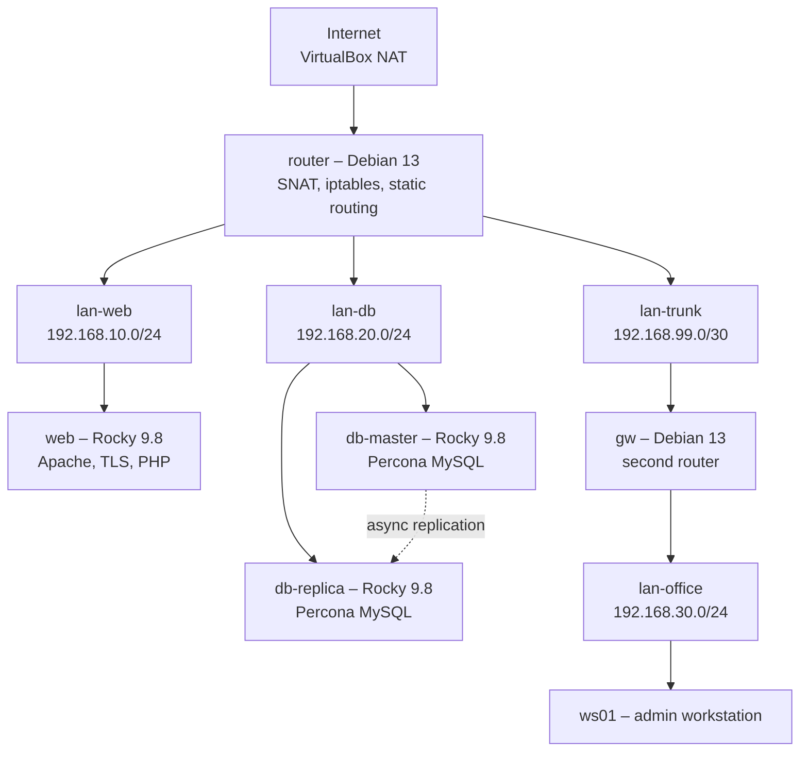

# homelab

A multi-VM network stand built in VirtualBox: routing between isolated
subnets, a web server with TLS, and a Percona MySQL master/replica pair
with working asynchronous replication. Everything below was configured
by hand and debugged from real failures, not copied from a tutorial.

## Architecture



lan-office can reach web and db-master/db-replica but has no route to the
internet – enforced on router's FORWARD chain, not by omission.

## Subnets

| Network | CIDR | Gateway |
|---|---|---|
| lan-web | 192.168.10.0/24 | 192.168.10.1 (router) |
| lan-db | 192.168.20.0/24 | 192.168.20.1 (router) |
| lan-trunk | 192.168.99.0/30 | router .1 ↔ gw .2 |
| lan-office | 192.168.30.0/24 | 192.168.30.1 (gw) |

## Hosts

| Host | OS | Role | Address |
|---|---|---|---|
| router | Debian 13 | routing, NAT, firewall | 10.0.2.x (NAT), .10.1, .20.1, .99.1 |
| gw | Debian 13 | second-hop router for the office subnet | .99.2, .30.1 |
| ws01 | Debian 13 | admin workstation – sole point of SSH access to web/db | .30.10 |
| web | Rocky 9.8 | Apache, TLS, PHP | .10.10 |
| db-master | Rocky 9.8 | Percona MySQL, replication source | .20.10 |
| db-replica | Rocky 9.8 | Percona MySQL, async replica | .20.11 |

## Access model

The host reaches `router` through a VirtualBox NAT port forward
(`127.0.0.1:2222 → 22`). From there, administration is bastion-style:

```
host → router → gw → ws01 → web / db-master / db-replica
```

`web`, `db-master`, and `db-replica` have no NAT adapter and accept SSH
only from `192.168.30.10` (ws01) – there is deliberately no direct path
from `router` to them. This mirrors a real jump-host setup: one audited
point of entry instead of every box being reachable from everywhere.

## Firewall

`router`'s FORWARD chain defaults to DROP with an explicit allow-list:
office → web/db only, no office → internet, established/related traffic
always passes. `web`, `db-master`, and `db-replica` each run their own
local iptables on top of that (default DROP, only the ports and source
IPs they actually need) – network-level and host-level filtering are
independent layers, not a substitute for each other.

## Repository layout

```
router/       – /etc/network/interfaces, sysctl, iptables rules
gw/           – same, for the second router
ws01/         – network config for the admin workstation
web/          – httpd config, TLS vhost, PHP app, iptables, NM connection
db-master/    – my.cnf, iptables, NM connection, user/replication SQL, dump
db-replica/   – same, plus replication setup and gotchas
scripts/      – healthcheck, log rotation, backup (see below)
docker-compose/ – standalone local demo, no VirtualBox required
docs/         – VM/adapter layout reference
```

Each host folder's files map 1:1 to real paths on that machine – file
names match, so restoring is `cp <file> <original path>`, not guesswork.
No private keys or certificates are committed; passwords in SQL files
are placeholders.

## Deploying from scratch

1. Create the VirtualBox network topology per `docs/vm-setup.md`
   (adapters, internal network names, NAT port forward).
2. Install Debian 13 minimal on router/gw/ws01, Rocky 9.8 minimal on
   web/db-master/db-replica.
3. Copy each host's config files to their real paths, apply
   (`ifup`/`nmcli connection up`, `iptables-restore`, service restarts).
4. On db-master, run the setup SQL, note the binlog position from
   `SHOW MASTER STATUS`.
5. On db-replica, load the dump, then run `setup-replication.sql` with
   that position, verify `SHOW REPLICA STATUS\G` shows both threads
   running.
6. Deploy the scripts below and wire up cron.

## Scripts

| Script | Runs on | Does |
|:-:|---|---|
| `healthcheck.sh` (WIP) | ws01 | SSHes into web/db-master/db-replica, checks that httpd/mysqld are active |
| `log_rotate_parse.sh` | web | Summarizes Apache access log (top IPs, status code breakdown, 4xx/5xx count), rotates it |
| `db_backup.sh` (WIP) | db-master | Dumps homelab DB, restores the dump into a throwaway database, compares row counts to confirm the backup is actually restorable |

`healthcheck.sh` needs passwordless SSH from ws01 to the other hosts:

```bash
ssh-keygen -t ed25519 -C "ws01-healthcheck"
ssh-copy-id padavan@192.168.10.10
ssh-copy-id padavan@192.168.20.10
ssh-copy-id padavan@192.168.20.11
```

`db_backup.sh` needs `/root/.my.cnf` on db-master (`chmod 600`) with
`[client]` / `user=root` / `password=...`, so credentials never appear
in the process list or shell history.

Example crontab entries:

```
# ws01, as padavan
*/15 * * * * /home/padavan/scripts/healthcheck.sh

# web, as root
0 1 * * * /root/scripts/log_rotate_parse.sh

# db-master, as root
0 2 * * * /root/scripts/db_backup.sh
```

## docker-compose demo

A separate, self-contained reproduction of the web+db pair – same
Apache/PHP/MySQL logic, no VirtualBox, runs anywhere Docker is installed:

```bash
cd docker-compose
docker compose up -d
curl http://localhost:8080
```

This does not replace the VM stand – it demonstrates the same
application stack containerized, which is a different skill than
provisioning and routing between real VMs.

## Known limitations

- `gw` has no local firewall yet – filtering for the office subnet
  currently happens only on `router`.
- No internal DNS (bind9) – hosts are addressed by IP; the web TLS
  certificate's CN (`web.lab.local`) won't match unless you add it to
  `/etc/hosts` locally.
- Backup verification checks row counts on one table (`test_records`);
  a production version would checksum every table.
